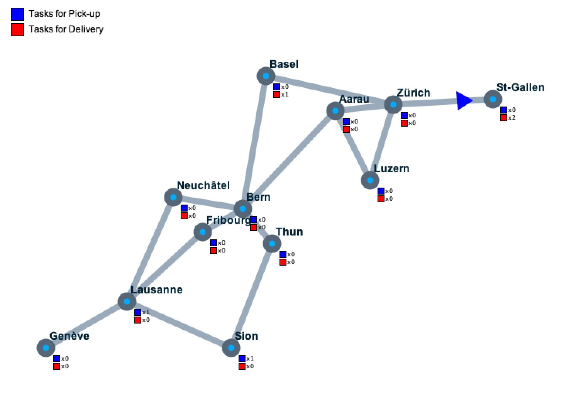

# Reactive Agents, CS-430 Assignement 3

Implementation of a planning deliberative agent with graph-search algorithms.

## Tasks from the problem definition :
* **DONE** Choose an adequate reprensentation of **states**, **transitions** and **goals** (final states), such that BFS or ASTAR will be able to find an optimal solution for the pickup and delivery problem ==> see doc/problemDefinition.pdf
* **DONE(kinda)** Implement BFS and ASTAR, choose an algorithm and justify
  * Complexity of BFS makes it basically unable to deal with the dimensionality of the problem
* **NOT DONE** Implement a deliberative agent that can use the above algorithms
* **NOT DONE** Compare performance of ASTAR and BFS for various problem sizes
* **NOT DONE** Run the simulation with 1,2,3 deliberative agent and report on the diffrences and joint performances of the agents

## Todo : 

* Define states, transitions and goals representations in doc **DONE**
* Implement the agent
  * **DONE(kinda)** Implement the state class
  * **DONE** The succ function for a given state class
  * **DONE** goal detection
  * **DONE** Plan generation from states
  * **NOT DONE** some way to solve using BFS which is not atrocious
  * **NOT DONE** implement a heuristic function that makes more sense or at least justify why the fuck it workds how it does not
  * **NOT DONE** re-planning
* Write a report